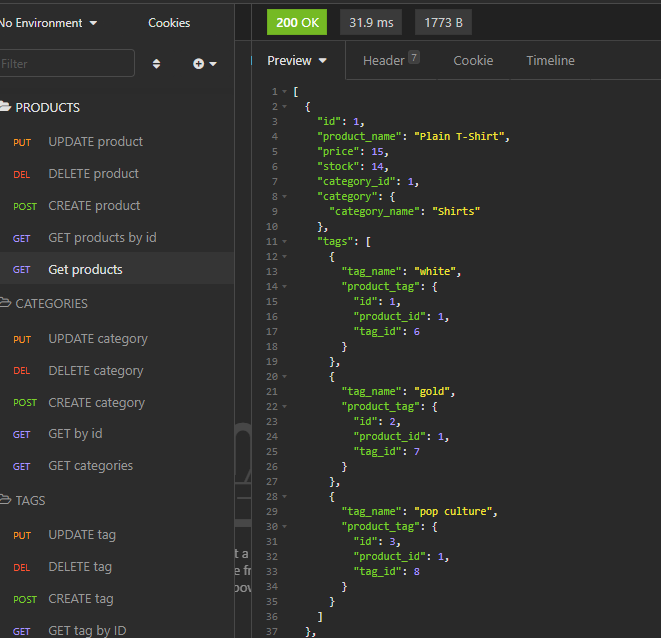

# E-Commerce-Backend (Object-Relational Mapping)

## Description 

This application uses Express.js API and Sequelize to interact with the MySQL database. 

The SQL database includes tables for products, product tags, tags, and categories. 

RESTful API routes are used to make requests and updates from the database which are joined through Sequelize queries.



## Demo 

<a href="https://drive.google.com/file/d/1GFcGkttLOdu2HipRFfpmp1kD4RsyHTE2/view?usp=sharing" rel="generator demo"></a><br>(click to open video)


## Usage 

***NOTE: MySQL must be installed on your computer***

1. Clone the repo
```
git clone git@github.com:jshmtchll/e-commerce-back-end.git
```
2. Install the dependencies
```
npm install
```
3. Start the server
```
npm start
```

## Technology
* Node.js
* Express.js
* MySQL
* Dotenv
* Sequelize

## Questions?

GitHub: [@jshmtchll](https://github.com/users/jshmtchll)

Email: jshmtchll@gmail.com